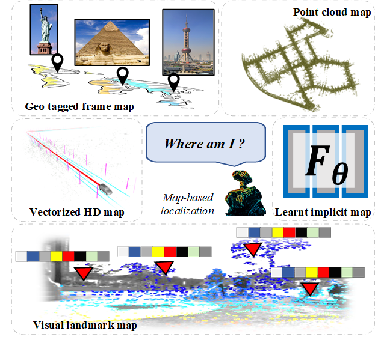
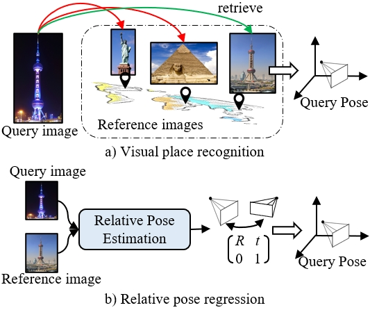
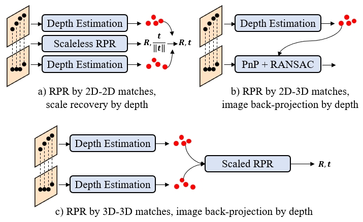
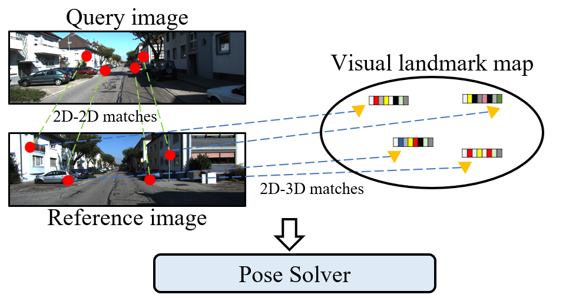
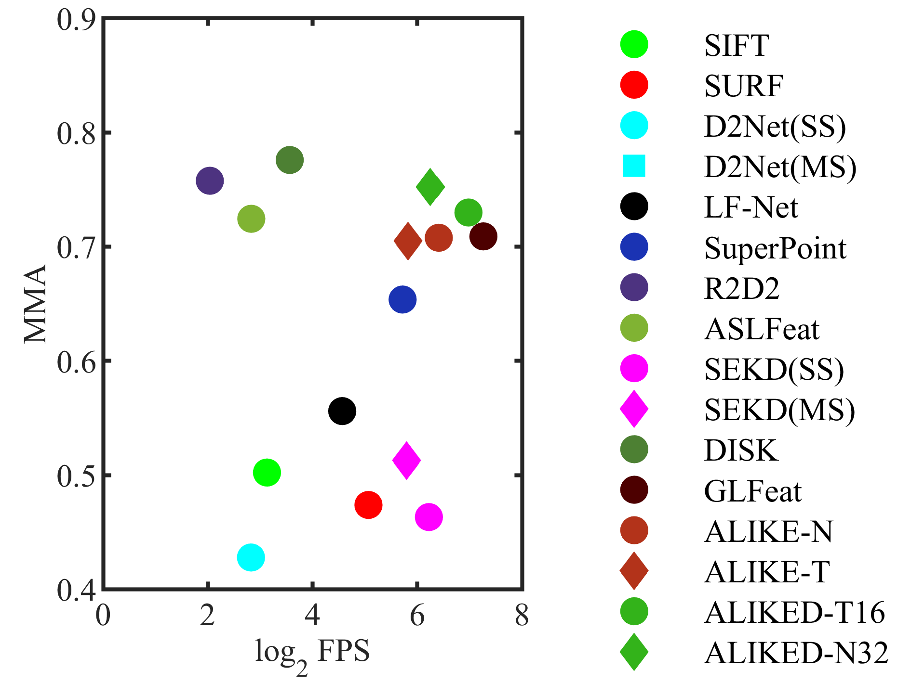
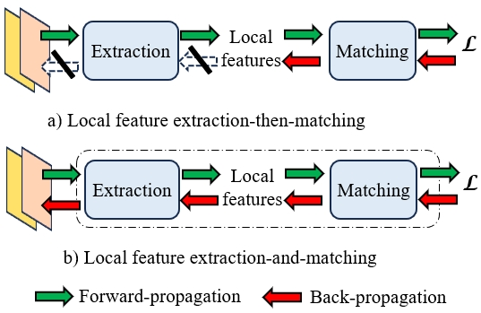
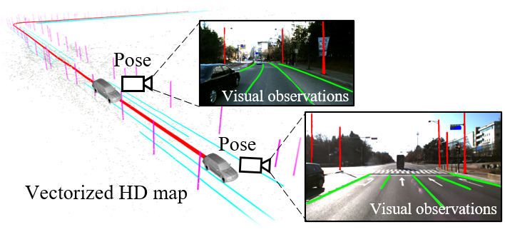
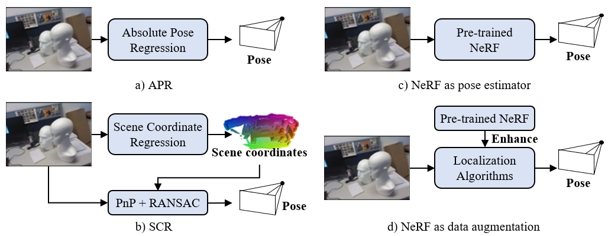

# Reviewing Monocular Re-Localization From the Perspective of Scene Map

This repo contains a curative list of monocular relocalzation algorithm, which is categorized into five classes based on its utilized scene map. Comprehensive review can be found in our [survey](https://arxiv.org/abs/2311.15643) 

> ```
> Jinyu Miao, Kun Jiang, Tuopu Wen, Yunlong Wang, Peijing Jia, Xuhe Zhao, Qian Cheng, Zhongyang Xiao, Jin Huang, Zhihua Zhong, Diange Yang, "A Survey on Monocular Re-Localization: From the Perspective of Scene Map Representation," arXiv preprint arXiv:2311.15643, 2023.
> ```

We welcome the community to kindly [pull requests](./assets/how-to-PR.md) or [email](mailto:jinyu.miao97@gmail.com) to add related monocular relocalization papers. We make efforts to provide long-term contributions to our community! 

If you find this repository useful, please consider [citing](#citation) and staring this repository. Feel free to share this repository with others!

<div align="center">

</div>

***

Overview
---
- [Other Relevant Survey](#other-relevant-survey)
- [Geo-tagged Frame Map](#a-geo-tagged-frame-map)
  - [Visual Place Recognition](#a-1-visual-place-recognition)
  - [Relative Pose Estimation](#a-2-relative-pose-estimation)
- [Visual Landmark Map](#b-visual-landmark-map)
  - [Local Feature Extraction-then-Matching](#b-1-local-feature-extraction-then-matching)
  - [Joint Local Feature Extraction-and-Matching](#b-2-joint-local-feature-extraction-and-matching)
  - [Pose Solver](#b-3-pose-solver)
  - [Further Improvements](#b-4-further-improvements)
- [Point Cloud Map](#c-point-cloud-map)
  - [Geometry-based Cross-modal Localization](#c-1-geometry-based-cross-modal-localization)
  - [Learning-based Cross-modal Localization](#c-2-learning-based-cross-modal-localization)
- [Vectorized HD Map](#d-vectorized-hd-map)
- [Learned Implicit Map](#e-learnt-implicit-map)
  - [Absolute Pose Regression](#e-1-absolute-pose-regression)
  - [Scene Coordinate Regression](#e-2-scene-coordinate-regression)
  - [Neural Radiance Field](#e-3-neural-radiance-field)

***

## Other Relevant Survey

* [AIR'15] Visual Simultaneous Localization and Mapping: A Survey [paper](https://link.springer.com/article/10.1007/s10462-012-9365-8)
* [TRO'16] Visual place recognition: A survey [paper](https://ieeexplore.ieee.org/document/7339473)
* [TRO'16] Past, Present, and Future of Simultaneous Localization And Mapping: Towards the Robust-Perception Age [paper](https://arxiv.org/abs/1606.05830) [repo](https://github.com/SLAM-future/slam-future)
* [PR'18] A survey on Visual-Based Localization: On the benefit of heterogeneous data [paper](https://www.sciencedirect.com/science/article/pii/S0031320317303448)
* [IJCAI'21] Where is your place, visual place recognition? [paper](https://www.ijcai.org/proceedings/2021/0603.pdf)
* [PR'21] Visual place recognition: A survey from deep learning perspective [paper](https://www.sciencedirect.com/science/article/pii/S003132032030563X)
* [TITS'22] The revisiting problem in simultaneous localization and mapping: A survey on visual loop closure detection [paper](https://ieeexplore.ieee.org/document/9780121)
* [arxiv] General Place Recognition Survey: Towards the Real-world Autonomy Age [paper](https://arxiv.org/abs/2209.04497)
* [arxiv] A Survey on Visual Map Localization Using LiDARs and Cameras [paper](https://arxiv.org/abs/2208.03376)
* [arxiv] Visual and object geo-localization: A comprehensive survey [paper](https://arxiv.org/abs/2112.15202)
* [arxiv] A Survey on Deep Learning for Localization and Mapping: Towards the Age of Spatial Machine Intelligence [paper](https://arxiv.org/abs/2006.12567) [repo](https://github.com/changhao-chen/deep-learning-localization-mapping)

***

## A Geo-tagged Frame Map

**Geo-tagged Frame Map** is composed of posed keyframes. 

The related visual relocalization algorithm can be classified into two categories: *Visual Place Recognition (VPR)* and *Relative Pose Estimation (RPR)*.

<div align="center">

</div>

### A-1 Visual Place Recognition

Given current *query* image, VPR identifies the re-observed places by retrieving *reference* image(s) when the vehicle goes back to a previously visited scene, which is often used as coarse step in hierarchical localization pipeline or *Loop Closure Detection (LCD)* module in *Simultaneous Localization and Mapping (SLAM)* system. The pose of retrieved *reference* image(s) can be regarded as an apporximated pose of current *query* image.

#### Global feature-based visual place recognition

* [ICRA'00] Appearance-based place recognition for topological localization [paper](https://ieeexplore.ieee.org/document/844734)
* [CVPR'05] Histograms of oriented gradients for human detection [paper](https://ieeexplore.ieee.org/abstract/document/1467360)
* [TRO'09] Biologically inspired mobile robot vision localization [paper](https://ieeexplore.ieee.org/document/5071253)
* [CVPR'10] Aggregating local descriptors into a compact image representation [paper](https://ieeexplore.ieee.org/document/5540039)
* [TPAMI'18] NetVLAD: CNN architecture for weakly supervised place recognition [paper](https://ieeexplore.ieee.org/document/7937898) [code(MATLAB)](https://ieeexplore.ieee.org/document/7937898) [code(PyTorch)](https://github.com/Nanne/pytorch-NetVlad)
* [TPAMI'19] Fine-tuning cnn image retrieval with no human annotation [paper](https://ieeexplore.ieee.org/document/8382272)
* [IROS'19] Fast and Incremental Loop Closure Detection Using Proximity Graphs [paper](https://ieeexplore.ieee.org/document/8968043) [code](https://github.com/AnshanTJU/FILD)
* [TNNLS'20] Spatial pyramid enhanced netvlad with weighted triplet loss for place recognition [[paper](https://ieeexplore.ieee.org/document/8700608)
* [RAL'20] Co-HoG: A light-weight, compute-efficient, and training-free visual place recognition technique for changing environments [paper](https://ieeexplore.ieee.org/document/8972582)
* [PR'21] Vector of locally and adaptively aggregated descriptors for image feature representation [paper](https://www.sciencedirect.com/science/article/pii/S0031320321001394)
* [RAL'21] ESA-VLAD: A lightweight network based on second-order attention and netvlad for loop closure detection [paper](https://ieeexplore.ieee.org/document/9472966)
* [CVPR'21] Patch-NetVLAD: Multi-scale fusion of locally-global descriptors for place recognition [paper](https://ieeexplore.ieee.org/document/9577552) [code](https://github.com/QVPR/Patch-NetVLAD)
* [JFR'22] Fast and incremental loop closure detection with deep features and proximity graphs [paper](https://onlinelibrary.wiley.com/doi/10.1002/rob.22060) [code](https://github.com/anshan-XR-ROB/FILD)
* [CVPR'22] TransVPR: Transformer-based place recognition with multi-level attention aggregation [paper](https://ieeexplore.ieee.org/document/9879296)
* [WACV'23] MixVPR: Feature mixing for visual place recognition [paper](https://ieeexplore.ieee.org/document/10030191) [code](https://github.com/amaralibey/MixVPR)
* [arxiv] Anyloc: Towards universal visual place recognition [paper](https://arxiv.org/abs/2308.00688) [code](https://github.com/AnyLoc/AnyLoc)

#### Local feature-based visual place recognition

* [IJRR'08] FAB-MAP: Probabilistic localization and mapping in the space of appearance [paper](https://journals.sagepub.com/doi/abs/10.1177/0278364908090961) [code](https://www.robots.ox.ac.uk/~mjc/Software.htm)
* [IJRR'11] Appearance-only SLAM at large scale with FAB-MAP 2.0 [paper](https://journals.sagepub.com/doi/10.1177/0278364910385483)
* [IROS'11] Real-time loop detection with bags of binary words [paper](https://ieeexplore.ieee.org/document/6094885)
* [TRO'12] Automatic visual Bag-of-Words for online robot navigation and mapping [paper](https://ieeexplore.ieee.org/document/6198362)
* [TRO'12] Bags of binary words for fast place recognition in image sequences [paper](https://ieeexplore.ieee.org/document/6202705) [DBoW](https://github.com/dorian3d/DBow) [DBoW2](https://github.com/dorian3d/DBoW2) [DBoW3](https://github.com/rmsalinas/DBow3)
* [ICRA'15] IBuILD: Incremental bag of binary words for appearance based loop closure detection [paper](https://ieeexplore.ieee.org/document/7139959)
* [RSS'15] Place recognition with convnet landmarks: Viewpoint-robust, condition-robust, training-free [paper](https://www.roboticsproceedings.org/rss11/p22.pdf)
* [IROS'15] On the performance of convnet features for place recognition [paper](https://ieeexplore.ieee.org/document/7353986)
* [TRO'17] Hierarchical place recognition for topological mapping [paper](https://ieeexplore.ieee.org/document/7938750) [code](https://github.com/emiliofidalgo/htmap)
* [AuRo'18] BoCNF: Efficient image matching with bag of convnet features for scalable and robust visual place recognition [paper](https://link.springer.com/article/10.1007/s10514-017-9684-3)
* [RAL'18] iBoW-LCD: An appearance-based loop-closure detection approach using incremental bags of binary words [paper](https://ieeexplore.ieee.org/document/8392377) [code](https://github.com/emiliofidalgo/ibow-lcd)
* [ICRA'18] Assigning visual words to places for loop closure detection [paper](https://ieeexplore.ieee.org/document/8461146) [code](https://github.com/ktsintotas/assigning-visual-words-to-places)
* [RAL'19] Probabilistic appearance-based place recognition through bag of tracked words [paper](https://ieeexplore.ieee.org/document/8633405) [code](https://github.com/ktsintotas/Bag-of-Tracked-Words)
* [IROS'19] Fast and Incremental Loop Closure Detection Using Proximity Graphs [paper](https://ieeexplore.ieee.org/document/8968043) [code](https://github.com/AnshanTJU/FILD)
* [IROS'19] Robust loop closure detection based on bag of superpoints and graph verification [paper](https://ieeexplore.ieee.org/abstract/document/8967726)
* [BMVC'20] LiPo-LCD: Combining lines and points for appearance-based loop closure detection [paper](https://www.bmvc2020-conference.com/conference/papers/paper_0789.html)
* [TII'21] Semantic Loop Closure Detection With Instance-Level Inconsistency Removal in Dynamic Industrial Scenes [paper](https://ieeexplore.ieee.org/abstract/document/9145862)
* [JFR'22] Automatic vocabulary and graph verification for accurate loop closure detection [paper](https://onlinelibrary.wiley.com/doi/10.1002/rob.22088)
* [TITS'22] Loop-closure detection using local relative orientation matching [paper](https://ieeexplore.ieee.org/document/9423519)
* [PRL'22] Discriminative and semantic feature selection for place recognition towards dynamic environments [paper](https://www.sciencedirect.com/science/article/pii/S0167865521004050)
* [JFR'22] Fast and incremental loop closure detection with deep features and proximity graphs [paper](https://onlinelibrary.wiley.com/doi/10.1002/rob.22060) [code](https://github.com/anshan-XR-ROB/FILD)

#### Sequence feature-based visual place recognition

* [ICRA'12] SeqSLAM: Visual route-based navigation for sunny summer days and stormy winter nights [paper](https://ieeexplore.ieee.org/document/6224623?denied=)
* [ICRA'17] Fast-SeqSLAM: A fast appearance based place recognition algorithm [paper](https://ieeexplore.ieee.org/abstract/document/7989671)
* [RAL'20] Delta descriptors: Change-based place representation for robust visual localization [paper](https://ieeexplore.ieee.org/document/9128035/) [code](https://github.com/oravus/DeltaDescriptors)
* [RAL'21] Seqnet: Learning descriptors for sequence-based hierarchical place recognition [paper](https://arxiv.org/pdf/2102.11603v2.pdf) [code](https://github.com/oravus/seqNet)
* [RAL'22] Learning Sequential Descriptors for Sequence-Based Visual Place Recognition [paper](https://ieeexplore.ieee.org/document/9842298) [code](https://github.com/vandal-vpr/vg-transformers)

#### Semantic-based visual place recognition

* [RAL'18] X-View: Graph-based semantic multi-view localization [paper](https://ieeexplore.ieee.org/abstract/document/8281068)
* [TII'21] Semantic Loop Closure Detection With Instance-Level Inconsistency Removal in Dynamic Industrial Scenes [paper](https://ieeexplore.ieee.org/abstract/document/9145862)

### A-2 Relative Pose Estimation

RPR methods aims to estimate the relative pose between *query* image and *reference* image in the map.

#### Geometry-based relative pose estimation

<div align="center">

</div>

* [ICRA'20] To learn or not to learn: Visual localization from essential matrices [paper](https://patrick-llgc.github.io/Learning-Deep-Learning/paper_notes/to_learn_or_not.html)
* [ICCV'21] Calibrated and partially calibrated semi-generalized homographies [paper](https://arxiv.org/abs/2103.06535)
* [ECCV'22] Map-free visual relocalization: Metric pose relative to a single image [paper](https://github.com/nianticlabs/map-free-reloc) [project](https://github.com/nianticlabs/map-free-reloc)
* [arxiv'23] Lazy Visual Localization via Motion Averaging [paper](https://arxiv.org/abs/2307.09981)

#### Regression-based relative pose estimation

* [ICCVW'17] Camera relocalization by computing pairwise relative poses using convolutional neural network [paper](https://openaccess.thecvf.com/content_ICCV_2017_workshops/papers/w17/Laskar_Camera_Relocalization_by_ICCV_2017_paper.pdf)
* [ACIVS'17] Relative camera pose estimation using convolutional neural networks [paper](https://arxiv.org/abs/1702.01381)
* [ECCV'18] Relocnet: Continuous metric learning relocalisation using neural nets [paper](https://link.springer.com/chapter/10.1007/978-3-030-01264-9_46)
* [ECCVW'19] Rpnet: An end-to-end network for relative camera pose estimation [paper](https://link.springer.com/chapter/10.1007/978-3-030-11009-3_46)
* [IROS'21] Distillpose: Lightweight camera localization using auxiliary learning [paper](https://arxiv.org/abs/2108.03819)
* [CVPR'21] Extreme rotation estimation using dense correlation volumes [paper](https://ieeexplore.ieee.org/document/9577404/)
* [CVPR'21] Wide-baseline relative camera pose estimation with directional learning [paper](https://ieeexplore.ieee.org/document/9577882)
* [ICRA'21] Learning to localize in new environments from synthetic training data [paper](https://arxiv.org/pdf/2011.04539.pdf)
* [ECCV'22] Map-free visual relocalization: Metric pose relative to a single image [paper](https://github.com/nianticlabs/map-free-reloc) [project](https://github.com/nianticlabs/map-free-reloc)

## B Visual Landmark Map

<div align="center">

</div>

**Visual landmark Map** is composed by visual landmarks. Visual landmarks are some informative and representative 3D points that lifted from 2D pixels by 3D reconstruction, and they are associated with corresponding local features in various observed *reference* images including 2D key point and high-dimensional descriptor. During localization stage, *query* image is first matched with *reference* image(s) and the resulting 2D-2D matches are lifted to 2D-3D matches between *query* image and visual landmark map, which can be used to solve scaled pose as a typical *Perspective-n-Point (PnP)* problem.

### B-1 Local Feature Extraction-then-Matching

#### Local feature extraction

<div align="center">

</div>

* [IJCV'04] Distinctive image features from scale-invariant key points
* [CVIU'08] Speeded-up robust features (SURF)
* [ECCV'10] BRIEF: Binary robust independent elementary features
* [ICCV'11] BRISK: Binary robust invariant scalable keypoints
* [ICCV'11] ORB: An efficient alternative to sift or surf
* [NeurIPS'17] Working hard to know your neighbor's margins: Local descriptor learning loss [paper](https://proceedings.neurips.cc/paper/2017/file/831caa1b600f852b7844499430ecac17-Paper.pdf) [code](https://github.com/DagnyT/hardnet)
* [ICCV'17] Large-scale image retrieval with attentive deep local features [paper](https://ieeexplore.ieee.org/abstract/document/8237636) [code](https://github.com/nashory/DeLF-pytorch)
* [CVPRW'18] SuperPoint: Self-supervised interest point detection and description [paper](https://ieeexplore.ieee.org/document/8575521) [official code](https://github.com/magicleap/SuperPointPretrainedNetwork) [code](https://github.com/rpautrat/SuperPoint) [code](https://github.com/eric-yyjau/pytorch-superpoint)
* [ECCV'18] Geodesc: Learning local descriptors by integrating geometry constraints [paper](https://link.springer.com/chapter/10.1007/978-3-030-01240-3_11)
* [CVPR'19] L2-net: Deep learning of discriminative patch descriptor in euclidean space [paper](https://ieeexplore.ieee.org/document/8100132) [code](https://github.com/L2-Net/L2Net)
* [CVPR'19] SoSNet: Second order similarity regularization for local descriptor learning [paper](https://ieeexplore.ieee.org/document/8954064/) [code](https://github.com/scape-research/SOSNet)
* [CVPR'19] Contextdesc: Local descriptor augmentation with cross-modality context [paper](https://ieeexplore.ieee.org/document/8953736) [code](https://github.com/lzx551402/contextdesc)
* [CVPR'19] D2-Net: A trainable CNN for joint description and detection of local features [paper](https://ieeexplore.ieee.org/document/8953622) [code](https://github.com/mihaidusmanu/d2-net)
* [NeurIPS'19] R2D2: Repeatable and reliable detector and descriptor [paper](https://papers.nips.cc/paper/2019/file/3198dfd0aef271d22f7bcddd6f12f5cb-Paper.pdf) [code](https://github.com/naver/r2d2)
* [CVPR'20] ASLFeat: Learning local features of accurate shape and localization [paper](https://ieeexplore.ieee.org/abstract/document/9156696/) [code](https://github.com/lzx551402/ASLFeat)
* [NeurIPS'20] DISK: Learning local features with policy gradient [paper](https://papers.nips.cc/paper/2020/file/a42a596fc71e17828440030074d15e74-Paper.pdf) [code](https://github.com/cvlab-epfl/disk)
* [ICCV'21] Learning deep local features with multiple dynamic attentions for large-scale image retrieval [paper](https://ieeexplore.ieee.org/document/9711149/) [code](https://github.com/CHANWH/MDA)
* [IROS'21] RaP-Net: A region-wise and point-wise weighting network to extract robust features for indoor localization [paper](https://ieeexplore.ieee.org/document/9636248/) [code](https://github.com/ivipsourcecode/RaP-Net)
* [PRL'22] Discriminative and semantic feature selection for place recognition towards dynamic environments [paper](https://www.sciencedirect.com/science/article/pii/S0167865521004050)
* [TMM'22] ALIKE: Accurate and lightweight keypoint detection and descriptor extraction [paper](https://ieeexplore.ieee.org/document/9726928/) [code](https://github.com/Shiaoming/ALIKE)
* [ICIRA'22] Real-time local feature with global visual information enhancement [paper](https://ieeexplore.ieee.org/document/10006314)
* [AAAI'22] MTLDesc: Looking wider to describe better [paper](https://aaai.org/papers/02388-mtldesc-looking-wider-to-describe-better/) [code](https://github.com/vignywang/MTLDesc)
* [TIM'23] ALIKED: A lighter keypoint and descriptor extraction network via deformable transformation [paper](https://ieeexplore.ieee.org/abstract/document/10111017) [code](https://github.com/Shiaoming/ALIKED)
* [arxiv] SEKD: Self-evolving keypoint detection and description [paper](https://arxiv.org/abs/2006.05077) [code](https://github.com/aliyun/Self-Evolving-Keypoint-Demo)


#### Local feature matching

* [ECCV'08] A linear time histogram metric for improved sift matching [paper](https://link.springer.com/chapter/10.1007/978-3-540-88690-7_37) 
* [ECCV'08] Feature correspondence via graph matching: Models and global optimization [paper](https://link.springer.com/chapter/10.1007/978-3-540-88688-4_44)
* [IJCV'10] Rejecting mismatches by correspondence function [paper](https://link.springer.com/article/10.1007/s11263-010-0318-x)
* [PRL'12] Good match exploration using triangle constraint [paper](https://www.sciencedirect.com/science/article/abs/pii/S0167865511002765)
* [ToG'14] Feature matching with bounded distortion [paper] (https://dl.acm.org/doi/abs/10.1145/2602142)
* [TPAMI'14] Scalable nearest neighbor algorithms for high dimensional data [paper](https://ieeexplore.ieee.org/abstract/document/6809191)
* [TIP'14] Robust point matching via vector field consensus [paper](https://ieeexplore.ieee.org/abstract/document/6746218)
* [TVCG'15] Regularization based iterative point match weighting for accurate rigid transformation estimation [paper](https://ieeexplore.ieee.org/abstract/document/7055263)
* [TIP'15] Matching images with multiple descriptors: An unsupervised approach for locally adaptive descriptor selection [paper](https://ieeexplore.ieee.org/abstract/document/7312974)
* [TCSVT'15] Bb-homography: Joint binary features and bipartite graph matching for homography estimation [paper](https://ieeexplore.ieee.org/abstract/document/6857398)
* [ECCV'16] Guided matching based on statistical optical flow for fast and robust correspondence analysis [paper](https://link.springer.com/chapter/10.1007/978-3-319-46478-7_7)
* [CVPR'17] GMS: Grid-based motion statistics for fast, ultra-robust feature correspondence [paper](https://openaccess.thecvf.com/content_cvpr_2017/html/Bian_GMS_Grid-based_Motion_CVPR_2017_paper.html) [code](https://github.com/JiawangBian/GMS-Feature-Matcher)
* [TPAMI'17] Efficient & Effective Prioritized Matching for Large-Scale Image-Based Localization [paper](https://ieeexplore.ieee.org/abstract/document/7572201)
* [CVPR'17] Deep Semantic Feature Matching [paper](https://openaccess.thecvf.com/content_cvpr_2017/html/Ufer_Deep_Semantic_Feature_CVPR_2017_paper.html)
* [TGRS'18] Guided locality preserving feature matching for remote sensing image registration [paper](https://ieeexplore.ieee.org/abstract/document/8340808)
* [TPAMI'18] CODE: Coherence based decision boundaries for feature correspondence [paper](https://ieeexplore.ieee.org/abstract/document/7815414)
* [TCSVT'18] Dual calibration mechanism based l2, p-norm for graph matching [paper](https://ieeexplore.ieee.org/abstract/document/9195466)
* [TCSVT'18] Second- and high-order graph matching for correspondence problems [paper](https://ieeexplore.ieee.org/abstract/document/7954631)
* [CVIU'18] Hierarchical semantic image matching using cnn feature pyramid [paper](https://www.sciencedirect.com/science/article/abs/pii/S1077314218300018)
* [CVPR'18] Learning to find good correspondences [paper](https://openaccess.thecvf.com/content_cvpr_2018/html/Yi_Learning_to_Find_CVPR_2018_paper.html) [code](https://github.com/ubc-vision/image-matching-benchmark)
* [CVPR'19] NM-Net: Mining reliable neighbors for robust feature correspondences [paper](https://openaccess.thecvf.com/content_CVPR_2019/html/Zhao_NM-Net_Mining_Reliable_Neighbors_for_Robust_Feature_Correspondences_CVPR_2019_paper.html) [code](https://github.com/sailor-z/NM-Net)
* [IJCV'19] Locality preserving matching [paper](https://link.springer.com/article/10.1007/s11263-018-1117-z)
* [ECCV'20] Handcrafted outlier detection revisited [paper](https://link.springer.com/chapter/10.1007/978-3-030-58529-7_45) [code](https://github.com/cavalli1234/AdaLAM)
* [TCSVT'20] Image correspondence with cur decomposition-based graph completion and matching [paper](https://ieeexplore.ieee.org/abstract/document/8804232)
* [CVPR'20] ACNe: Attentive context normalization for robust permutation-equivariant learning [paper](https://openaccess.thecvf.com/content_CVPR_2020/html/Sun_ACNe_Attentive_Context_Normalization_for_Robust_Permutation-Equivariant_Learning_CVPR_2020_paper.html) [code](https://github.com/vcg-uvic/acne)
* [CVPR'20] SuperGlue: Learning feature matching with graph neural networks [paper](https://openaccess.thecvf.com/content_CVPR_2020/html/Sarlin_SuperGlue_Learning_Feature_Matching_With_Graph_Neural_Networks_CVPR_2020_paper.html) [code](https://github.com/magicleap/SuperGluePretrainedNetwork)
* [TPAMI'22] OANet: Learning two-view correspondences and geometry using order-aware network [paper](https://openaccess.thecvf.com/content_ICCV_2019/html/Zhang_Learning_Two-View_Correspondences_and_Geometry_Using_Order-Aware_Network_ICCV_2019_paper.html)
* [TCSVT'22] Probabilistic Spatial Distribution Prior Based Attentional Keypoints Matching Network [paper](https://ieeexplore.ieee.org/abstract/document/9386055)
* [ICCV'23] LightGlue: Local Feature Matching at Light Speed [paper](https://arxiv.org/abs/2306.13643) [code](https://github.com/cvg/lightglue)

<div align="center">

</div>

### B-2 Joint Local Feature Extraction-and-Matching

* [ECCV'20] Efficient neighbourhood consensus networks via submanifold sparse convolutions [paper](https://link.springer.com/chapter/10.1007/978-3-030-58545-7_35) [code](https://github.com/ignacio-rocco/sparse-ncnet)
* [NeurIPS'20] Dual-resolution correspondence networks [paper](https://proceedings.neurips.cc/paper/2020/hash/c91591a8d461c2869b9f535ded3e213e-Abstract.html) [code](https://github.com/ActiveVisionLab/DualRC-Net)
* [ICCV'21] COTR: Correspondence transformer for matching across images [paper](https://openaccess.thecvf.com/content/ICCV2021/html/Jiang_COTR_Correspondence_Transformer_for_Matching_Across_Images_ICCV_2021_paper.html) [code](https://github.com/ubc-vision/COTR)
* [CVPR'21] LoFTR: Detector-free local feature matching with transformers [paper](https://openaccess.thecvf.com/content/CVPR2021/html/Sun_LoFTR_Detector-Free_Local_Feature_Matching_With_Transformers_CVPR_2021_paper.html) [code](https://github.com/zju3dv/LoFTR)
* [TPAMI'22] NcNet: Neighbourhood consensus networks for estimating image correspondences [paper](https://ieeexplore.ieee.org/abstract/document/9167479)
* [ECCV'22] Aspanformer: Detector-free image matching with adaptive span transformer [paper](https://link.springer.com/chapter/10.1007/978-3-031-19824-3_2) [code](https://github.com/apple/ml-aspanformer)
* [ICCV'23] Occ^2net: Robust image matching based on 3d occupancy estimation for occluded regions [paper](https://openaccess.thecvf.com/content/ICCV2023/html/Fan_Occ2Net_Robust_Image_Matching_Based_on_3D_Occupancy_Estimation_for_ICCV_2023_paper.html)
* [arxiv] Quadtree attention for vision transformers [paper](https://arxiv.org/abs/2201.02767) [code](https://github.com/tangshitao/quadtreeattention)
* [arxiv] Tkwinformer: Top k window attention in vision transformers for feature matching [paper](https://arxiv.org/abs/2308.15144)

### B-3 Pose Solver

* [TPAMI'92] Exact and approximate solutions of the perspective-three-point problem [paper](https://www.researchgate.net/publication/2711194_Exact_And_Approximate_Solutions_Of_The_Perspective-3-Point_Problem)
* [ICCV'99] Camera pose and calibration from 4 or 5 known 3d points [paper](https://ieeexplore.ieee.org/abstract/document/791231)
* [TPAMI'99] Linear n-point camera pose determination [paper](https://ieeexplore.ieee.org/abstract/document/784291)
* [TPAMI'00] Fast and globally convergent pose estimation from video images [paper](https://ieeexplore.ieee.org/abstract/document/862199)
* [TPAMI'01] Efficient linear solution of exterior orientation [paper](https://ieeexplore.ieee.org/abstract/document/908965)
* [CVPR'08] A general solution to the p4p problem for camera with unknown focal length [paper](https://ieeexplore.ieee.org/abstract/document/4587793)
* [IJCV'09] EPnP: An accurate o(n) solution to the pnp problem [paper](https://link.springer.com/article/10.1007/s11263-008-0152-6)
* [IJPRAI'11] A stable direct solution of perspective-three-point problem [paper](https://www.worldscientific.com/doi/abs/10.1142/S0218001411008774)
* [ICCV'11] A direct least-squares (DLS) method for pnp [paper](https://ieeexplore.ieee.org/abstract/document/6126266)
* [TPAMI'12] A robust o(n) solution to the perspective-n-point problem [paper](https://ieeexplore.ieee.org/abstract/document/6143946)
* [ICCV'13] Revisiting the pnp problem: A fast, general and optimal solution [paper](https://openaccess.thecvf.com/content_iccv_2013/html/Zheng_Revisiting_the_PnP_2013_ICCV_paper.html)
* [ICRA'17] 6-dof object pose from semantic keypoints [paper](https://ieeexplore.ieee.org/abstract/document/7989233) [code](https://github.com/geopavlakos/object3d)
* [PRL'18] A simple, robust and fast method for the perspective-n-point problem [paper](https://www.sciencedirect.com/science/article/abs/pii/S0167865518300692)
* [IROS'19] An efficient and accurate algorithm for the perspecitve-n-point problem [paper](https://ieeexplore.ieee.org/abstract/document/8968482)
* [ECCV'20] A consistently fast and globally optimal solution to the perspective-n-point problem [paper](https://link.springer.com/chapter/10.1007/978-3-030-58452-8_28) [code](https://github.com/terzakig/sqpnp)
* [arxiv] MLPnP - a real-time maximum likelihood solution to the perspective-n-point problem [paper](https://arxiv.org/abs/1607.08112) [code](https://github.com/urbste/MLPnP_matlab)

### B-4 Further Improvements

#### Cross descriptor matching
* [ICCV'21] Cross-descriptor visual localization and mapping [paper](https://openaccess.thecvf.com/content/ICCV2021/supplemental/Dusmanu_Cross-Descriptor_Visual_Localization_ICCV_2021_supplemental.pdf) [code](https://github.com/mihaidusmanu/cross-descriptor-vis-loc-map)

#### Line feature
* [RAL'21] Line as a visual sentence: Context-aware line descriptor for visual localization [paper](https://ieeexplore.ieee.org/abstract/document/9535286) [code](https://github.com/yosungho/LineTR)
 
#### Dense CNN matching
* [RAL'19] GN-Net: The gauss-newton loss for multi-weather relocalization [paper](https://ieeexplore.ieee.org/abstract/document/8954808) [code](https://github.com/cvg/pixloc)
* [TPAMI'21] Inloc: Indoor visual localization with dense matching and view synthesis [paper](https://openaccess.thecvf.com/content_cvpr_2018/html/Taira_InLoc_Indoor_Visual_CVPR_2018_paper.html) [code](https://github.com/HajimeTaira/InLoc_demo)
* [ICCV'19] Is this the right place? geometric-semantic pose verifcation for indoor visual localization [paper](https://openaccess.thecvf.com/content_ICCV_2019/html/Taira_Is_This_the_Right_Place_Geometric-Semantic_Pose_Verification_for_Indoor_ICCV_2019_paper.html)

#### Localization without SfM
* [ECCV'22] Meshloc: Mesh-based visual localization [paper](https://link.springer.com/chapter/10.1007/978-3-031-20047-2_34) [code](https://github.com/tsattler/meshloc_release)

#### Map squeeze
* [CVPR'22] Scenesqueezer: Learning to compress scene for camera relocalization [paper](https://openaccess.thecvf.com/content/CVPR2022/html/Yang_SceneSqueezer_Learning_To_Compress_Scene_for_Camera_Relocalization_CVPR_2022_paper.html)

#### Pose verification and correction
* [ICCV'19] Is this the right place? geometric-semantic pose verifcation for indoor visual localization [paper](https://openaccess.thecvf.com/content_ICCV_2019/html/Taira_Is_This_the_Right_Place_Geometric-Semantic_Pose_Verification_for_Indoor_ICCV_2019_paper.html)
* [TPAMI'21] Inloc: Indoor visual localization with dense matching and view synthesis [paper](https://openaccess.thecvf.com/content_cvpr_2018/html/Taira_InLoc_Indoor_Visual_CVPR_2018_paper.html) [code](https://github.com/HajimeTaira/InLoc_demo)
* [ICCV'21] Pose correction for highly accurate visual localization in large-scale indoor spaces [paper](https://openaccess.thecvf.com/content/ICCV2021/html/Hyeon_Pose_Correction_for_Highly_Accurate_Visual_Localization_in_Large-Scale_Indoor_ICCV_2021_paper.html) [code](https://github.com/janghunhyeon/pcloc)

#### Opensourced toolbox

* [HLoc](https://github.com/cvg/Hierarchical-Localization)
* [Kapture](https://github.com/naver/kapture-localization)
* [XRLocalization](https://github.com/openxrlab/xrlocalization)

## C Point Cloud Map

**Point Cloud Map** only contains 3D position of point clouds and its intensity (somtimes missing). Monocular localization in point cloud map is also called cross-modal localization.

<div align="center">

</div>

### C-1 Geometry-based Cross-modal Localization

* [IROS'14] Visual localization within lidar maps for automated urban driving [paper](https://ieeexplore.ieee.org/abstract/document/6942558)
* [IROS'16] Monocular camera localization in 3d lidar maps [paper](https://ieeexplore.ieee.org/abstract/document/7759304)
* [IROS'18] Stereo camera localization in 3d lidar maps [paper](https://ieeexplore.ieee.org/abstract/document/8594362)
* [IROS'19] Metric monocular localization using signed distance fields [paper](https://ieeexplore.ieee.org/abstract/document/8968033)
* [IROS'20] Monocular camera localization in prior lidar maps with 2d-3d line correspondences [paper](https://ieeexplore.ieee.org/abstract/document/9341690) [code](https://github.com/levenberg/2D-3D-pose-tracking)
* [ICRA'20] Monocular direct sparse localization in a prior 3d surfel map [paper](https://ieeexplore.ieee.org/abstract/document/9197022)
* [RAL'20] GMMLoc: Structure consistent visual localization with gaussian mixture models [paper](https://ieeexplore.ieee.org/abstract/document/9126150) [code](https://github.com/HyHuang1995/gmmloc)

### C-2 Learning-based Cross-modal Localization

#### Cross-modal visual place recognition

* [ICRA'20] Global visual localization in lidar-maps through shared 2d-3d embedding space [paper](https://ieeexplore.ieee.org/abstract/document/9196859)
* [ICRA'21] Spherical multi-modal place recognition for heterogeneous sensor systems [paper](https://ieeexplore.ieee.org/abstract/document/9561078) [code](https://github.com/ethz-asl/s2loc)
* [RSS'21] i3dLoc: Image-to-range cross-domain localization robust to inconsistent environmental conditions [paper](https://arxiv.org/abs/2105.12883)
* [IEEE Sensor Journal'23] Attention-enhanced cross-modal localization between spherical images and point clouds [paper](https://ieeexplore.ieee.org/abstract/document/10227896)
* [arxiv] I2P-Rec:Recognizing images on large-scale point cloud maps through bird's eye view projections [paper](https://arxiv.org/abs/2303.01043)

#### Cross-modal relative pose regression

* [ITSC'19] CMRNet: Camera to lidar-map registration [paper](https://ieeexplore.ieee.org/abstract/document/8917470) [code](https://github.com/cattaneod/CMRNet)
* [ICRA'21] Hypermap: Compressed 3d map for monocular camera registration [paper](https://ieeexplore.ieee.org/abstract/document/9561864)
* [RAL'24] Poses as Queries: End-to-End Image-to-LiDAR Map Localization With Transformers [paper](https://ieeexplore.ieee.org/document/10333977)

### Cross-modal matching-based localization

* [ICRA'19] 2d3d-matchnet: Learning to match keypoints across 2d image and 3d point cloud [paper](https://ieeexplore.ieee.org/abstract/document/8794415)
* [CVPR'21] Neural reprojection error: Merging feature learning and camera pose estimation [paper](https://openaccess.thecvf.com/content/CVPR2021/html/Germain_Neural_Reprojection_Error_Merging_Feature_Learning_and_Camera_Pose_Estimation_CVPR_2021_paper.html) [code](https://github.com/germain-hug/NRE)
* [CVPR'21] Back to the feature: Learning robust camera localization from pixels to pose [paper](https://openaccess.thecvf.com/content/CVPR2021/html/Sarlin_Back_to_the_Feature_Learning_Robust_Camera_Localization_From_Pixels_CVPR_2021_paper.html) [code](https://github.com/cvg/pixloc)
* [CVPR'21] Deepi2p: Image-to-point cloud registration via deep classification [paper](https://openaccess.thecvf.com/content/CVPR2021/html/Li_DeepI2P_Image-to-Point_Cloud_Registration_via_Deep_Classification_CVPR_2021_paper.html) [code](https://github.com/lijx10/DeepI2P)
* [RAL'22] EFGHNet: A versatile image-to-point cloud registration network for extreme outdoor environment [paper](https://ieeexplore.ieee.org/abstract/document/9799751)
* [IJPRS'22] I2D-Loc: Camera localization via image to lidar depth flow [paper](https://www.sciencedirect.com/science/article/abs/pii/S0924271622002775)
* [TCSVT'23] Corri2p: Deep image-to-point cloud registration via dense correspondence [paper](https://ieeexplore.ieee.org/abstract/document/9900350) [code](https://github.com/rsy6318/CorrI2P)
* [arxiv] CMRet++: Map and camera agnostic monocular visual localization in lidar maps [paper](https://arxiv.org/abs/2004.13795)
* [arxiv] End-to-end 2d-3d registration between image and lidar point cloud for vehicle localization [paper](https://arxiv.org/abs/2306.11346)

## D Vectorized HD Map

The localization feature in the **HD Map** includes dense point cloud and sparse map element, here we focus on the sparse map elements usually represented as vectors with semantic labels.

<div align="center">

</div>

* [CVPRW'08] Visual map matching and localization using a global feature map [paper](https://ieeexplore.ieee.org/abstract/document/4563135)
* [IROS'13] Mapping and localization using gps, lane markings and proprioceptive sensors [paper](https://ieeexplore.ieee.org/abstract/document/6696383)
* [IV'14] Video based localization for bertha [paper](https://ieeexplore.ieee.org/abstract/document/6856560)
* [IV'17] Monocular localization in urban environments using road markings [paper](https://ieeexplore.ieee.org/abstract/document/7995762)
* [TITS'18] Self-localization based on visual lane marking maps: An accurate low-cost approach for autonomous driving [paper](https://ieeexplore.ieee.org/abstract/document/8063437)
* [Sensors'18] Integration of gps, monocular vision, and high definition (hd) map for accurate vehicle localization [paper](https://www.mdpi.com/1424-8220/18/10/3270)
* [ITSC'18] Monocular vehicle self-localization method based on compact semantic map [paper](https://ieeexplore.ieee.org/abstract/document/8569274)
* [IEEE Sensors Journal'19] Self-localization based on visual lane marking maps: An accurate low-cost approach for autonomous driving [paper](https://ieeexplore.ieee.org/abstract/document/8063437)
* [ICCR'19] Coarse-to-fine visual localization using semantic compact map [paper](https://ieeexplore.ieee.org/abstract/document/9344376)
* [Sensors'20] Monocular localization with vector hd map (mlvhm): A low-cost method for commercialivs [paper](https://www.mdpi.com/1424-8220/20/7/1870)
* [IV'20] High precision vehicle localization based on tightly-coupled visual odometry and vector hd map [paper](https://ieeexplore.ieee.org/abstract/document/9304659)
* [IROS'20] Monocular localization in hd maps by combining semantic segmentation and distance transform [paper](https://ieeexplore.ieee.org/abstract/document/9341003)
* [IROS'21] Coarse-to-fine semantic localization with hd map for autonomous driving in structural scenes [paper](https://ieeexplore.ieee.org/abstract/document/9635923)
* [ICRA'21] Visual Semantic Localization based on HD Map for Autonomous Vehicles in Urban Scenarios [paper](https://ieeexplore.ieee.org/abstract/document/9561459)
* [JAS'22] A lane-level road marking map using a monocular camera [paper](https://ieeexplore.ieee.org/abstract/document/9583170)
* [TITS'22] Tm3loc: Tightly-coupled monocular map matching for high precision vehicle localization [paper](https://ieeexplore.ieee.org/abstract/document/9784872)
* [CVPR'23] OrienterNet: Visual Localization in 2D Public Maps with Neural Matching [paper](https://openaccess.thecvf.com/content/CVPR2023/html/Sarlin_OrienterNet_Visual_Localization_in_2D_Public_Maps_With_Neural_Matching_CVPR_2023_paper.html)
* [arxiv] BEV-Locator:An end-to-end visual semantic localization network using multi-view images [paper](https://arxiv.org/abs/2211.14927)
* [arxiv] Egovm: Achieving precise ego-localization using lightweight vectorized maps [paper](https://arxiv.org/abs/2307.08991)

## E Learnt Implicit Map

Some recently proposed works implicitly encode scene map into neural networks so that the network can achieve amazing things, such as directly recover pose of images (called *Absolute Pose Regression, APR*), estimate 3D coordinates of each pixel in images (called *Scene Coordinate Regression, SCR*), or render geometry structure and appearance of scene (called *Neural Radiance Field, NeRF*). We name such scene map-related information in trained neural network as **Learnt Implicit Map**.

<div align="center">

</div>

### E-1 Absolute Pose Regression

#### Single scene absolute pose regression

* [ICCV'15] Posenet: A convolutional network for real-time 6-dof camera relocalization [paper](https://openaccess.thecvf.com/content_iccv_2015/html/Kendall_PoseNet_A_Convolutional_ICCV_2015_paper.html) [code](https://github.com/alexgkendall/caffe-posenet)
* [ICRR'21] Do we really need scene-specific pose encoders? [paper](https://ieeexplore.ieee.org/abstract/document/9412225)
* [IROS'17] Deep regression for monocular camera-based 6-dof global localization in outdoor environments [paper](https://ieeexplore.ieee.org/abstract/document/8205957)
* [ICCVW'17] Image-based localization using hourglass networks [paper](https://openaccess.thecvf.com/content_ICCV_2017_workshops/w17/html/Melekhov_Image-Based_Localization_Using_ICCV_2017_paper.html)
* [ICRA'16] Modelling uncertainty in deep learning for camera relocalization [paper](https://ieeexplore.ieee.org/abstract/document/7487679) [code](https://github.com/alexgkendall/caffe-posenet)
* [ICCV'17] Image-based localization using lstms for structured feature correlation [paper](https://openaccess.thecvf.com/content_iccv_2017/html/Walch_Image-Based_Localization_Using_ICCV_2017_paper.html)
* [CVPR'17] Geometric loss functions for camera pose regression with deep learning [paper](https://openaccess.thecvf.com/content_cvpr_2017/html/Kendall_Geometric_Loss_Functions_CVPR_2017_paper.html) [code](https://github.com/imanlab/deep_movement_primitives)
* [CVPR'18] Geometry-aware learning of maps for camera localization [paper](https://openaccess.thecvf.com/content_cvpr_2018/html/Brahmbhatt_Geometry-Aware_Learning_of_CVPR_2018_paper.html) [code](https://github.com/NVlabs/geomapnet)
* [BMVC'18] Improved visual relocalization by discovering anchor points [paper](https://arxiv.org/abs/1811.04370)
* [ICCV'19] Local supports global: Deep camera relocalization with sequence enhancement [paper](https://openaccess.thecvf.com/content_ICCV_2019/html/Xue_Local_Supports_Global_Deep_Camera_Relocalization_With_Sequence_Enhancement_ICCV_2019_paper.html)
* [AAAI'20] Atloc: Attention guided camera localization [paper](https://ojs.aaai.org/index.php/AAAI/article/view/6608) [code](https://github.com/BingCS/AtLoc)
* [ICASSP'21] CaTiLoc: Camera image transformer for indoor localization [paper](https://ieeexplore.ieee.org/abstract/document/9414939)

#### Multiple scene absolute pose regression

* [CVPRW'20] Extending absolute pose regression to multiple scenes [paper](https://openaccess.thecvf.com/content_CVPRW_2020/html/w3/Blanton_Extending_Absolute_Pose_Regression_to_Multiple_Scenes_CVPRW_2020_paper.html)
* [ICCV'21] Learning multi-scene absolute pose regression with transformers [paper](https://openaccess.thecvf.com/content/ICCV2021/html/Shavit_Learning_Multi-Scene_Absolute_Pose_Regression_With_Transformers_ICCV_2021_paper.html) [code](https://github.com/yolish/multi-scene-pose-transformer)
* [TPAMI'23] Coarse-to-fine multi-scene pose regression with transformers [paper](https://ieeexplore.ieee.org/abstract/document/10236469) [code](https://github.com/yolish/c2f-ms-transformer)

### E-2 Scene Coordinate Regression

#### Scene-specific SCR

* [CVPR'13] Scene coordinate regression forests for camera relocalization in rgb-d images [paper](https://openaccess.thecvf.com/content_cvpr_2013/html/Shotton_Scene_Coordinate_Regression_2013_CVPR_paper.html)
* [CVPR'14] Multi-output learning for camera relocalization [paper](https://www.cv-foundation.org/openaccess/content_cvpr_2014/html/Guzman-Rivera_Multi-Output_Learning_for_2014_CVPR_paper.html)
* [CVPR'15] Exploiting uncertainty in regression forests for accurate camera relocalization [paper](https://openaccess.thecvf.com/content_cvpr_2015/html/Valentin_Exploiting_Uncertainty_in_2015_CVPR_paper.html)
* [CVPR'17] DSAC - differentiable ransac for camera localization [paper](https://openaccess.thecvf.com/content_cvpr_2017/html/Brachmann_DSAC_-_Differentiable_CVPR_2017_paper.html) [code](https://github.com/cvlab-dresden/DSAC)
* [CVPR'18] Learning less is more - 6d camera localization via 3d surface regression [paper](https://openaccess.thecvf.com/content_cvpr_2018/html/Brachmann_Learning_Less_Is_CVPR_2018_paper.html) [code](https://github.com/vislearn/LessMore)
* [ICCV'19] Expert sample consensus applied to camera re-localization [paper](https://openaccess.thecvf.com/content_ICCV_2019/html/Brachmann_Expert_Sample_Consensus_Applied_to_Camera_Re-Localization_ICCV_2019_paper.html) [code](https://github.com/vislearn/esac)
* [CVPR'20] Hierarchical scene coordinate classification and regression for visual localization [paper](https://openaccess.thecvf.com/content_CVPR_2020/html/Li_Hierarchical_Scene_Coordinate_Classification_and_Regression_for_Visual_Localization_CVPR_2020_paper.html)
* [CVPR'21] VS-Net: Voting with segmentation for visual localization [paper](https://openaccess.thecvf.com/content/CVPR2021/html/Huang_VS-Net_Voting_With_Segmentation_for_Visual_Localization_CVPR_2021_paper.html) [code](https://github.com/zju3dv/VS-Net)
* [TPAMI'22] Visual camera re-localization from rgb and rgb-d images using dsac [paper](https://ieeexplore.ieee.org/abstract/document/9394752)
* [3DV'22] Visual localization via few-shot scene region classification [paper](https://ieeexplore.ieee.org/abstract/document/10044413) [code](https://github.com/siyandong/src)
* [arxiv] Large scale joint semantic re-localisation and scene understanding via globally unique instance coordinate regression [paper](https://arxiv.org/abs/1909.10239)
* [arxiv] Hscnet++: Hierarchical scene coordinate classification and regression for visual localization with transformer [paper](https://arxiv.org/abs/2305.03595)

#### Scene-agnostic SCR

* [ICCV'19] SANet: Scene agnostic network for camera localization [paper](https://openaccess.thecvf.com/content_ICCV_2019/html/Yang_SANet_Scene_Agnostic_Network_for_Camera_Localization_ICCV_2019_paper.html)
* [CVPR'21] Learning camera localization via dense scene matching [paper](https://openaccess.thecvf.com/content/CVPR2021/html/Tang_Learning_Camera_Localization_via_Dense_Scene_Matching_CVPR_2021_paper.html) [code](https://github.com/Tangshitao/Dense-Scene-Matching)
* [CVPR'2023] Neumap: Neural coordinate mapping by auto-transdecoder for camera localization [paper](https://openaccess.thecvf.com/content/CVPR2023/html/Tang_NeuMap_Neural_Coordinate_Mapping_by_Auto-Transdecoder_for_Camera_Localization_CVPR_2023_paper.html) [code](https://github.com/tangshitao/neumap)
* [arxiv] D2S: Representing local descriptors and global scene coordinates for camera relocalization [paper](https://arxiv.org/abs/2307.15250) [code](https://github.com/ais-lab/feat2map)
* [arxiv] SACReg: Scene-agnostic coordinate regression for visual localization [paper](https://arxiv.org/abs/2307.11702)

### E-3 Neural Radiance Field

* [ECCV'20] Nerf: Representing scenes as neural radiance fields for view synthesis [paper](https://dl.acm.org/doi/abs/10.1145/3503250) [code](https://github.com/bmild/nerf)


#### NeRF as pose estimator

* [ICCV'21] GNeRF: Gan-based neural radiance field without posed camera [paper](https://openaccess.thecvf.com/content/ICCV2021/html/Meng_GNeRF_GAN-Based_Neural_Radiance_Field_Without_Posed_Camera_ICCV_2021_paper.html) [code](https://github.com/quan-meng/gnerf)
* [CVPR'23] NoPe-NeRF: Optimising neural radiance field with no pose prior [paper](https://openaccess.thecvf.com/content/CVPR2023/html/Bian_NoPe-NeRF_Optimising_Neural_Radiance_Field_With_No_Pose_Prior_CVPR_2023_paper.html) [code](https://github.com/ActiveVisionLab/nope-nerf)
* [ICRA'23] LATITUDE: Robotic global localization with truncated dynamic low-pass filter in city-scale nerf [paper](https://ieeexplore.ieee.org/abstract/document/10161570) [code](https://github.com/jike5/LATITUDE)
* [ICRA'23] LocNeRF: Monte carlo localization using neural radiance fields [paper](https://ieeexplore.ieee.org/abstract/document/10160782)
* [arxiv] NeRF-Loc: Visual localization with conditional neural radiance field [paper](https://arxiv.org/abs/2304.07979) [code](https://github.com/jenningsl/nerf-loc)

#### NeRF as data augmentation

* [3DV'21] Direct-PoseNet: Absolute pose regression with photometric consistency [paper](https://ieeexplore.ieee.org/abstract/document/9665846) [code](https://github.com/ActiveVisionLab/direct-posenet)
* [ECCV'22] DFNet: Enhance absolute pose regression with direct feature matching [paper](https://so.cljtscd.com/scholar?hl=zh-CN&as_sdt=0%2C14&q=DFNet%3A+Enhance+absolute+pose+regression+with+direct+feature+matching&btnG=) [code](https://github.com/activevisionlab/dfnet)
* [CoRL'22] LENS: Localization enhanced by nerf synthesis [paper](https://proceedings.mlr.press/v164/moreau22a.html)

## Citation

If you found this repository and survey helpful, please consider citing our related survey:
```
@article{miao2023MRL,
      title={A Survey on Monocular Re-Localization: From the Perspective of Scene Map Representation}, 
      author={Jinyu Miao, Kun Jiang, Tuopu Wen, Yunlong Wang, Peijing Jia, Benny Wijaya, Xuhe Zhao, Qian Cheng, Zhongyang Xiao, Jin Huang, Zhihua Zhong, Diange Yang},
      journal={arXiv preprint arXiv:2311.15643},
      year={2023}
}
```
